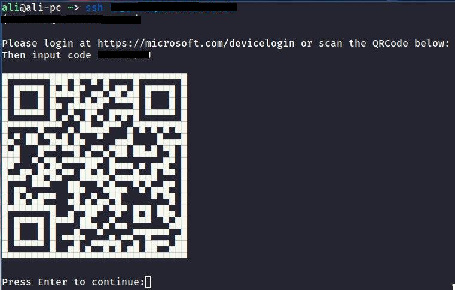

# Azure oAuth Device Grant Flow PAM module

Change SSH login to use Azure OAuth 2.0 device authorization grant flow to authenticate instead of using the normal password. 



## How to Run

First we need to bypass the normal password authentication. In `/etc/pam.d/sshd`, find a line with `@include common-auth`, comment it out. Then, add `auth       required     deviceflow.so`, where deviceflow.so is a module that we will compile shortly. The file should look like this:

```
# @include common-auth    # Disable password authentication
auth       required     azuremfa.so   # Plug in our authentication module
```

Next, we need to make sure PAM modules are enabled. In `/etc/ssh/sshd_config`, we should change `ChallengeResponseAuthentication no` to `ChallengeResponseAuthentication yes`. Also, we need to make sure there is a line `UsePAM yes`. The file should look like this:

```
ChallengeResponseAuthentication yes
UsePAM yes
```

## Compile and install azuremfa.so

`azuremfa.so` is the PAM module that handles authentication with Azure's Device Flow capability. Check the tutorial to make sure you have enabled Device Flow grant type on your authentication server. To compile this module, you need a few packages, install these in Ubuntu:

```
apt install build-essential libpam0g-dev libcurl4-openssl-dev libqrencode-dev libssl-dev -y
```

There are two source files. 
* `azuremfa.c`: This has all the logic to handle device flow and PAM interactions. 
* `qr.c`: This is used to generate ASCII QR code. It is borrowed from [here](https://github.com/Y2Z/qr) (changed main function to turn it into a function call). 

To compile:

Open `azuremfa.c` and enter your `TENANT_ID` and `CLIENT_ID` in the respective fields

```
gcc -fPIC -c azuremfa.c qr.c
sudo ld -x --shared -o /lib/security/azuremfa.so azuremfa.o qr.o -lm -lqrencode -lcurl -lssl -lcrypto
```

You need to restart sshd server for the change to take effect, e.g., `/etc/init.d/ssh restart` depending on your SSHD setup.


## Referance

Most of this code is *borrowed* from Okta's implementation

